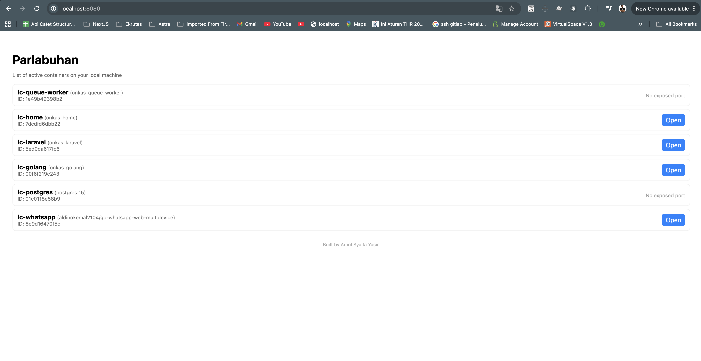

# 📦 Parlabuhan

**Parlabuhan** is a lightweight **local container browser** for developers.  
It provides a clean and fast web UI for viewing local Docker images, running containers, logs, and system information — all without requiring Docker Desktop.

Perfect for developers who want a simple container explorer with zero setup.

---

## 🚀 Features

- 🔍 Browse local Docker containers
- 📄 View container logs in real-time
- 🏷 View local Docker images
- ▶️ Start / stop / remove containers easily
- 📊 System info (Docker version, disk usage, stats)
- ⚡ Very fast — written in **Golang**
- 🔒 No external dependencies
- 🌐 Web UI (single binary, no install)

---

## 🖥️ Screenshot



---

## 🐳 Run with Docker

```bash
docker run -d \
  -p 8080:8080 \
  -v /var/run/docker.sock:/var/run/docker.sock \
  amrilsyaifa/parlabuhan:latest
```

## 🐳 Run with Docker Compose

Create a `docker-compose.yml` with Parlabuhan service:

```yaml
services:
  parlabuhan:
    image: amrilsyaifa/parlabuhan:latest
    container_name: parlabuhan
    ports:
      - "8080:8080"
    volumes:
      - /var/run/docker.sock:/var/run/docker.sock
    restart: unless-stopped
```
